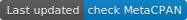

# Welcome to obogaf::parser's perl5 module! 

|          | Bioconda Badges | CPAN  Badges |
| -------- | --------------- | ------------ | 
| License |  | 
| Last Version |  | 
| Last Updated | |  
| Total Downloads |  | 
| Sphinx Doc |  | 
| Code Coverage |  | 

---

``obogaf::parser`` is a perl5 module to parse *obo* (Open Biological and Biomedical Ontology) and *gaf* (Gene Annotation File) file.

The ``obogaf::parser`` reference manual is available at following [link](https://metacpan.org/pod/obogaf::parser) or by typing on terminal``perldoc obogaf::parser`` (after installing the module).

A comprehensive tutorial showing how to install and how to apply ``obogaf::parser`` to real bio-medical case studies is available at the following [link](https://obogaf-parser.readthedocs.io).
